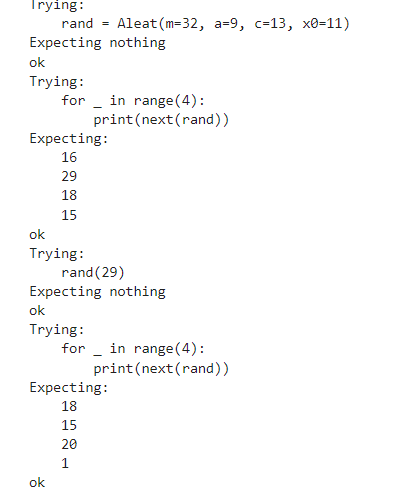
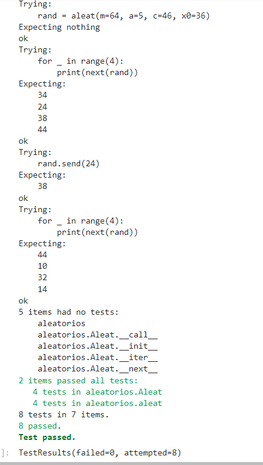
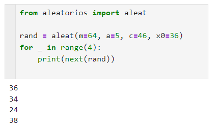

# Cuarta tarea de APA 2023: Generación de números aleatorios

**Nombre y apellidos:** Guillem Orta Talavera
**Fecha de entrega:** 3 de mayo a medianoche

## Descripción de la tarea
El objetivo de esta tarea es la implementación y uso de iteradores y funciones generadoras en Python para la creación de números pseudoaleatorios utilizando el algoritmo de Generación Lineal Congruente (LGC).

## Código desarrollado
A continuación se muestra el código fuente implementado en el fichero `aleatorios.py` con el correspondiente realce sintáctico:

```python
"""
aleatorios.py

Autor/a: Guillem Orta
Descripció: Implementació d'un generador de nombres pseudoaleatoris
utilitzant l'algorisme de Generació Lineal Congruent (LGC).
"""

class Aleat:
    def __init__(self, *, m=2**48, a=25214903917, c=11, x0=1212121):
        self.m = m
        self.a = a
        self.c = c
        self.x = x0

    def __iter__(self):
        return self

    def __next__(self):
        self.x = (self.a * self.x + self.c) % self.m
        return self.x

    def __call__(self, nova_semilla):
        self.x = nova_semilla


def aleat(*, m=2**48, a=25214903917, c=11, x0=1212121):
    """
    Generador de nombres aleatoris usant el mètode funció generadora
    """
    x = x0
    while True:
        x = (a * x + c) % m
        nova_semilla = yield x
        if nova_semilla is not None:
            x = nova_semilla


```

## Tests per a la clase aleat

S'han fet els tests corresponents i com a resultat s'ha obtingut el que s'esperava:






Test de la classe aleat



Test de la funció aleat()

